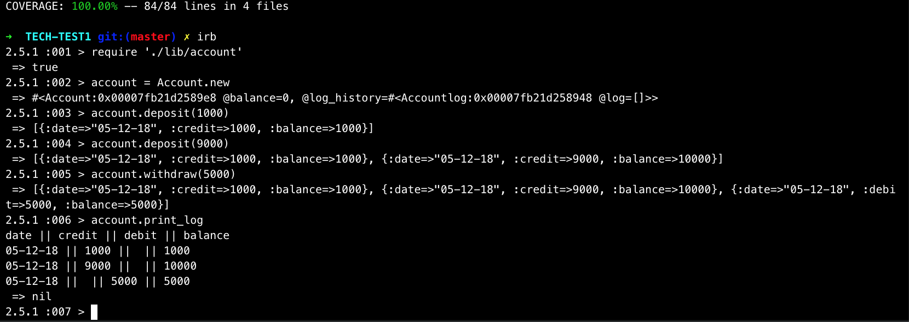

# Bank_tech_test

This is the week 10 tech test challenge at Makers. This project is to show my ability to 
It is an app which a client can "deposit", "withdraw" and "print statement" on a REPL like IRB.
https://github.com/makersacademy/course/blob/master/individual_challenges/bank_tech_test.md


Setup:
-------
```
Make sure you have ruby installed to interact with the code via a REPL like IRB.
```
**Run Program**
  * Download/clone this repo
  * Open your terminal and CD into the Directory
  * Install gem dependencies by running `bundle install`
  * Run IRB/PRY (make sure you have these setup )
  * Load ./lib/account.rb into IRB/pry

    <table>
      <tr><th>REPL</th><th>link</th>
      <tr>
        <th>
          irb
        </th>
        <td>
          <a href="https://www.ruby-lang.org/en/documentation/quickstart/">https://www.ruby-lang.org/en/documentation/quickstart/</a>
        </td>
      </tr>
      <tr>
        <th>
          pry
        </th>
        <td>
           <a href="http://pryrepl.org/">http://pryrepl.org/</a>
        </td>
    </table>

**Test Program**
  * Download/clone this repo
  * Open your terminal and CD into the Directory
  * Run IRB/PRY (make sure you have these setup )
  * Run Rspec
  ( All test are stored in the Spec folder )

**Rspec** This was used for consistent a TDD approach (Red-Green).
**Simplecove** This was used to get my test coverage.
**Rubocop** This was to insure code formatting was consistent throughout.

User story:
-------

````
As a client
to save money,
I would like to deposit money on my account.

As a client
to purchase goods,
I would like to withdraw money from my account.

As a client
to track my transactions,
I would like a printed statement with dates.

````

Domain model
-------


Process
-------
Following the TDD process of writing a failing test and then passing it, also making sure to have regular commits to git.
I have used 'git status' to see any files that need to be committed, which allows me to keep track of my work flow.
I've found regular commits and writing test then passing them makes for a better understanding of my code.
Also following this process allows me to write clear code which is easy to change.
